# OR-2894 Refactoring Summary

## Context
Working on OR-2894, a major architectural refactoring to implement clean architecture. Previous commits show moving to clean architecture with contracts, reorganizing solution structure, and refactoring GRAR AdresMatch.

## Current Architecture

> **📊 Diagram Images**: To generate PNG/SVG images of these diagrams, copy the Mermaid code to [mermaid.live](https://mermaid.live/) or use the provided `generate-diagrams.js` script with `@mermaid-js/mermaid-cli`.

### Clean Architecture Overview

```mermaid
graph TB
    subgraph "External Interfaces"
        API[Admin.Api<br/>REST API Controllers]
        AddressSync[Admin.AddressSync<br/>Address Synchronization Service]
        KboSync[KboMutations.SyncLambda<br/>KBO Synchronization Lambda]
        ProjectionHost[Admin.ProjectionHost<br/>Event Projections]
        PublicProjectionHost[Public.ProjectionHost<br/>Public Read Models]
    end
    
    subgraph "Application Services"
        CommandHandling[AssociationRegistry.CommandHandling<br/>CQRS Command Handlers]
        subgraph "Command Types"
            RegCmd[Registration Commands<br/>• RegistreerVerenigingZonderEigenRechtspersoonlijkheid<br/>• RegistreerVerenigingUitKbo]
            LidCmd[Membership Commands<br/>• VoegLidmaatschapToe<br/>• WijzigLidmaatschap<br/>• VerwijderLidmaatschap]
            LocCmd[Location Commands<br/>• VoegLocatieToe<br/>• WijzigLocatie<br/>• VerwijderLocatie]
            ContactCmd[Contact Commands<br/>• VoegContactgegevenToe<br/>• WijzigContactgegeven<br/>• VerwijderContactgegeven]
            SubCmd[Subtype Commands<br/>• VerfijnSubtypeNaarSubvereniging<br/>• VerfijnSubtypeNaarFeitelijkeVereniging]
        end
        subgraph "Middleware"
            DuplicateMiddleware[DuplicateDetectionMiddleware]
            EnrichMiddleware[EnrichLocatiesMiddleware]
        end
    end
    
    subgraph "Domain Core"
        Domain[AssociationRegistry<br/>Domain Models & Business Logic]
        subgraph "Domain DTOs"
            RegDTO[RegistratieDataVerenigingZonderEigenRechtspersoonlijkheid]
            LidDTO[ToeTeVoegenLidmaatschap<br/>TeWijzigenLidmaatschap]
            SubDTO[SubverenigingVanDto]
        end
        subgraph "Aggregates"
            VerenigingAgg[Vereniging Aggregate<br/>• Vereniging<br/>• VerenigingOfAnyKind<br/>• VerenigingMetRechtspersoonlijkheid]
            LidmaatschapAgg[Lidmaatschap Aggregate<br/>• Lidmaatschap<br/>• Lidmaatschappen]
            LocatieAgg[Locatie Aggregate<br/>• Locatie<br/>• Locaties]
            ContactAgg[Contact Aggregate<br/>• Contactgegeven<br/>• Contactgegevens]
            VertegenwoordigerAgg[Vertegenwoordiger Aggregate<br/>• Vertegenwoordiger<br/>• Vertegenwoordigers]
        end
        subgraph "Domain Events"
            Events[Event Sourcing<br/>• VerenigingWerdGeregistreerd<br/>• LidmaatschapWerdToegevoegd<br/>• LocatieWerdGewijzigd<br/>• ContactgegevenWerdVerwijderd]
        end
    end
    
    subgraph "Infrastructure & Integration"
        Contracts[AssociationRegistry.Contracts<br/>External API Contracts]
        Grar[AssociationRegistry.Grar<br/>Address Registry Integration]
        Magda[AssociationRegistry.Magda<br/>KBO Integration]
        EventStore[Marten Event Store<br/>PostgreSQL]
    end
    
    %% Dependencies (Clean Architecture)
    API --> CommandHandling
    AddressSync --> CommandHandling
    KboSync --> CommandHandling
    
    CommandHandling --> Domain
    CommandHandling --> Grar
    CommandHandling --> Magda
    CommandHandling --> Contracts
    
    Domain --> Contracts
    
    ProjectionHost --> Domain
    PublicProjectionHost --> Domain
    
    %% Command to DTO Mapping
    RegCmd -.-> RegDTO
    LidCmd -.-> LidDTO
    SubCmd -.-> SubDTO
    
    %% Event Store
    Domain --> EventStore
    CommandHandling --> EventStore
    
    classDef external fill:#e1f5fe
    classDef application fill:#f3e5f5
    classDef domain fill:#e8f5e8
    classDef infrastructure fill:#fff3e0
    
    class API,AddressSync,KboSync,ProjectionHost,PublicProjectionHost external
    class CommandHandling,RegCmd,LidCmd,LocCmd,ContactCmd,SubCmd,DuplicateMiddleware,EnrichMiddleware application
    class Domain,RegDTO,LidDTO,SubDTO,VerenigingAgg,LidmaatschapAgg,LocatieAgg,ContactAgg,VertegenwoordigerAgg,Events domain
    class Contracts,Grar,Magda,EventStore infrastructure
```

### Dependency Flow (Clean Architecture Principles)

```mermaid
graph LR
    subgraph "Dependency Direction"
        External[External Interfaces<br/>Controllers, APIs, Lambdas]
        App[Application Services<br/>Command Handlers]
        Dom[Domain Core<br/>Business Logic]
        Infra[Infrastructure<br/>Databases, External APIs]
    end
    
    External --> App
    App --> Dom
    App --> Infra
    Dom -.-> Infra
    
    note1[✅ Domain has no dependencies<br/>on external frameworks]
    note2[✅ Commands use Domain DTOs<br/>not the other way around]
    note3[✅ Infrastructure depends on<br/>Domain abstractions]
    
    classDef success fill:#e8f5e8
    class note1,note2,note3 success
```

## What was done:

### Phase 1: Created AssociationRegistry.CommandHandling project
- A new .NET 9 class library project to separate command handling concerns from the core domain.
- Moved all command handlers and commands from `DecentraalBeheer/Acties/`
- Moved KBO sync and GRAR sync command handlers
- Moved command middleware and related infrastructure

### Phase 2: Fixed Circular Dependencies
**Problem**: The domain (AssociationRegistry) was referencing commands in the application layer (CommandHandling), creating a circular dependency.

**Solution**: Moved DTOs from commands into the domain:
1. Created domain DTOs in AssociationRegistry:
   - `ToeTeVoegenLidmaatschap` and `TeWijzigenLidmaatschap` in `LidmaatschapDtos.cs`
   - `SubverenigingVanDto` in `SubverenigingDtos.cs`
   - `RegistratieDataVerenigingZonderEigenRechtspersoonlijkheid` in `RegistratieData.cs`

2. Updated domain methods to use domain DTOs instead of command DTOs:
   - `Lidmaatschap.Create()` now accepts `ToeTeVoegenLidmaatschap`
   - `Lidmaatschap.Wijzig()` now accepts `TeWijzigenLidmaatschap`
   - `Vereniging.RegistreerVerenigingZonderEigenRechtspersoonlijkheid()` now accepts domain DTO

3. Updated commands to use the domain DTOs:
   - Commands now reference and use the DTOs from the domain
   - Command handlers map command data to domain DTOs

### Phase 3: Additional Refactoring
- Moved `RecordProcessor.cs` from domain to CommandHandling (it was using commands)
- Fixed namespace references throughout the solution
- Removed the circular dependency between projects

## Architecture Benefits & Patterns:

### Clean Architecture Compliance:
1. **Dependency Inversion**: Domain core has zero dependencies on external frameworks
2. **Single Responsibility**: Each layer has a clear, single responsibility
3. **Open/Closed Principle**: Commands can be extended without modifying domain logic
4. **Interface Segregation**: Domain DTOs provide clean contracts between layers

### CQRS & Event Sourcing:
- **Command Query Separation**: Commands handled separately from queries/projections
- **Event Sourcing**: All state changes captured as domain events
- **Event Store**: Marten provides PostgreSQL-based event storage
- **Projection Hosts**: Separate services for building read models

### Domain-Driven Design (DDD):
- **Aggregates**: Clearly defined aggregate boundaries (Vereniging, Lidmaatschap, etc.)
- **Domain Events**: Business events that represent meaningful domain changes  
- **Value Objects**: Rich domain types (VCode, Datum, Email, etc.)
- **Repository Pattern**: Clean abstraction for aggregate persistence

### Technical Benefits:
1. **Testability**: Domain can be unit tested without infrastructure
2. **Maintainability**: Clear separation makes code easier to understand and modify
3. **Scalability**: Command handlers can be scaled independently
4. **Flexibility**: Can easily swap out infrastructure components
5. **Evolution**: Domain and commands can evolve independently

## Project References:
- AssociationRegistry.CommandHandling → AssociationRegistry (proper dependency direction)
- Admin.Api → CommandHandling
- Admin.AddressSync → CommandHandling
- KboMutations.SyncLambda → CommandHandling

## Build Status:
✅ Solution now builds successfully with only warnings (no errors)

## Git commits in this session:
- `refactor: or-2894 reorganize solution structure with logical folder hierarchy`
- `refactor: or-2894 refactor GRAR AdresMatch to clean architecture`
- `refactor: or-2894 extract command handling to separate project`