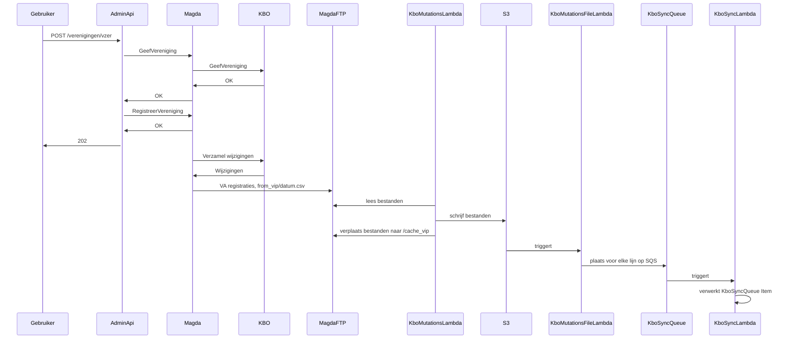

# Sequence Diagram

Hoe komt een item in de Kbo Sync Queue?

```mermaid
sequenceDiagram
    Gebruiker->>+AdminApi: POST /verenigingen/vzer
    AdminApi->>Magda: GeefVereniging
    Magda->>KBO: GeefVereniging
    KBO->>Magda: OK
    Magda->>AdminApi: OK
    AdminApi->>Magda: RegistreerVereniging
    Magda->>AdminApi: OK
    AdminApi->>Gebruiker: 202
    Magda->>KBO: Verzamel wijzigingen
    KBO->>Magda: Wijzigingen
    Magda->>MagdaFTP: VA registraties, from_vip/datum.csv
    KboMutationsLambda->>MagdaFTP: lees bestanden
    KboMutationsLambda->>S3: schrijf bestanden
    KboMutationsLambda->>MagdaFTP: verplaats bestanden naar /cache_vip
    S3->>KboMutationsFileLambda: triggert
    KboMutationsFileLambda->>KboSyncQueue: plaats voor elke lijn op SQS
    KboSyncQueue->>KboSyncLambda: triggert
    KboSyncLambda->>KboSyncLambda: verwerkt KboSyncQueue Item
```