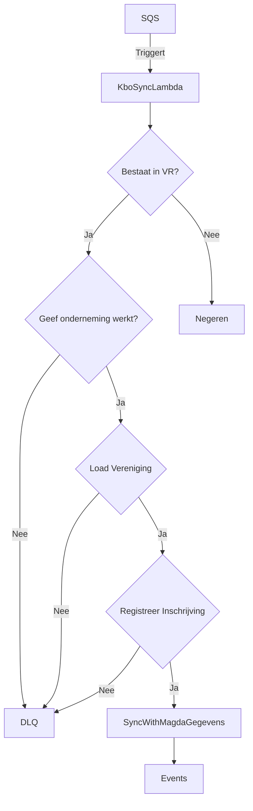

# Kbo Sync: Uitzonderingen

Dit schema geeft de Flow Chart weer over wanneer al dan niet een Kbo Sync command naar de DLQ te sturen bij fouten.

Zie ook:
- [ADR: Foutbehandeling Bij KBO Sync](/docs/ADRs/Foutbehandeling%20Bij%20KBO%20Sync.md)
- [ADR: RegistreerInschrijving voor KBO verenigingen](/docs/ADRs/RegistreerInschrijving%20voor%20KBO%20verenigingen.md)

## Flow Chart

