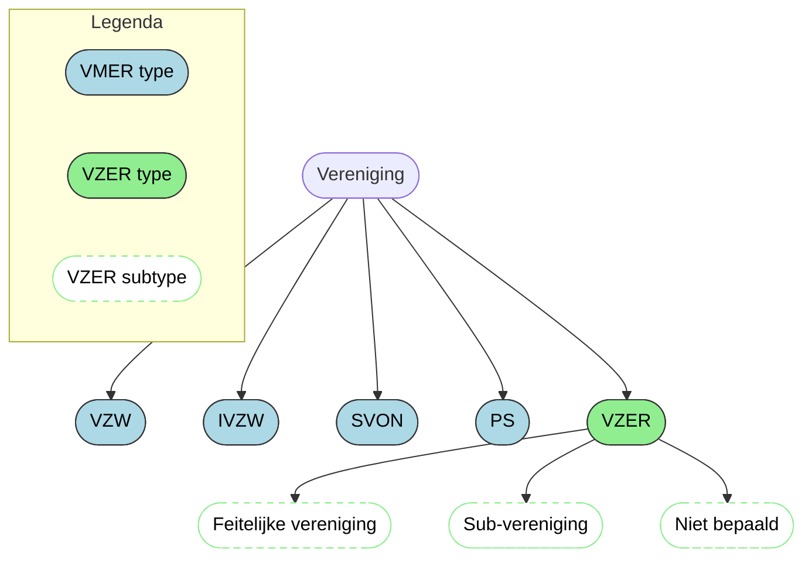

# Verenigingstypes en subtypes

Een vereniging heeft een verenigingstype en een verenigingssubtype. 

```mermaid
flowchart TB
    %% Main node
    A([Vereniging])
    
    %% Association types
    A --> B([VZW])
    A --> C([IVZW])
    A --> D([SVON])
    A --> E([PS])
    A --> F([VZER])
    
    %% Apply VMER styling to the 4 VMER types
    class B,C,D,E vmer
    
    %% Apply VZER styling to the VZER type
    class F vzer

    %% VZER subtypes
    F --> F1([Feitelijke vereniging])
    F --> F2([Sub-vereniging])
    F --> F3([Niet bepaald])
    class F1,F2,F3 vzerSub

    %% Legenda
    subgraph Legenda [Legenda]
      direction LR
      L1([VMER type])
      L2([VZER type])
      L3([VZER subtype])
    end
    class L1 vmer
    class L2 vzer
    class L3 vzerSub

    %% Class definitions with text in black
    classDef vmer fill:#ADD8E6,stroke:#333,stroke-width:1px,color:#000;
    classDef vzer fill:#90EE90,stroke:#333,stroke-width:1px,color:#000;
    classDef vzerSub fill:#FFFFFF,stroke:#90EE90,stroke-dasharray: 5,5,stroke-width:1px,color:#000;

```
